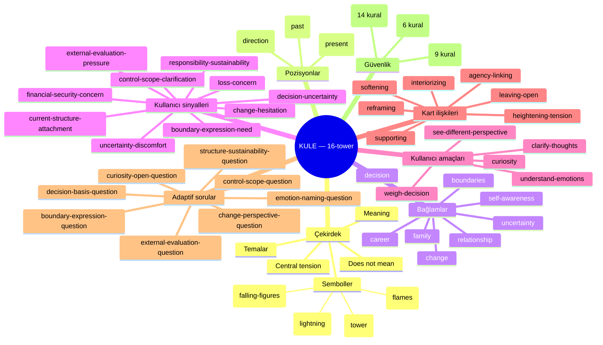

# Zihin Haritası — Kule (16-tower)

Bu harita, `data/interpretation-graph/cards/16-tower.json` içindeki
veri alanlarıyla birebir eşleşir; runtime kimlikleri parantez içinde
gösterilir. Kullanıcıya hiçbir düğüm teşhis atfetmez; "Yön" düğümü
gelecek/kader değil, düşünme merceğidir.

## Okunabilir metinsel outline

- **Kule (`16-tower`)**
  - **Çekirdek (`sourceLayer`)** — kaynağa dayalı katman
    - Temalar: beklenmedik farkındalık · mevcut temellerin sorgulanması
      · katılaşmış varsayımların esnemesi · yeniden değerlendirme için
      alan açılması
    - Meaning / Central tension / Does-not-mean listesi
    - 4 sembol: yıldırım, kule, alevler, düşen figürler — hepsi gerçek
      governed artwork'te (`public/assets/tarot-cards/v2/16_Kule.webp`)
      doğrulandı. `crown` (taç) görselde bulunmadığı için elenmiş aday.
  - **Pozisyonlar (`reflectionLayer.positions`)** — ürün tasarımı katmanı
    - Geçmiş (`past`) — önceki bir kırılmanın bugüne olası etkisi
    - Şimdi (`present`) — mevcut düzende sürdürülebilirliği sorgulanan
      unsurlar
    - Yön (`direction`) — **gelecek değil**, değerlendirme merceği;
      "trajectory"/"kader" değildir
  - **Bağlamlar (`reflectionLayer.contexts`)** — tam 8 adet: career,
    relationship, decision, family, boundaries, self-awareness,
    uncertainty, change
  - **Kullanıcı sinyalleri (`reflectionLayer.userSignalLenses`)** — tam
    10 adet, yalnız `explicit-user-selection`/`user-confirmed`
    kaynaklardan gelebilir; hiçbiri gizli/çıkarılmış profil değildir
  - **Kullanıcı amaçları** — `ontology/user-goals.json`'dan 5 amaç,
    kart node'unun sorularını tetikler
  - **Kart ilişkileri (`reflectionLayer.relationshipTypeRefs`)** — 7
    karttan bağımsız ilişki türünün tümüne referans; bugün için gerçek
    bir "komşu kart" yok (pilot tek kart), ileride ikinci kart
    eklendiğinde kullanılacak
  - **Adaptif sorular (`reflectionLayer.adaptiveQuestionRefs`)** — 8
    soru, her biri yalnız açık `topics`/`goals`/`explicitSignalRefs`
    ile tetiklenir; örtük/çıkarılmış tetikleyici yoktur
  - **Güvenlik (`safetyRefs` → `ontology/global-guardrails.json`)** —
    kart node'u kuralları kopyalamaz, yalnız 23 guardrail ID'sine
    referans verir (9 must + 14 mustNot; 6 "may" kuralı ürün-genelinde
    her karta açık izin olarak geçerlidir, kart-özel referans gerektirmez)
