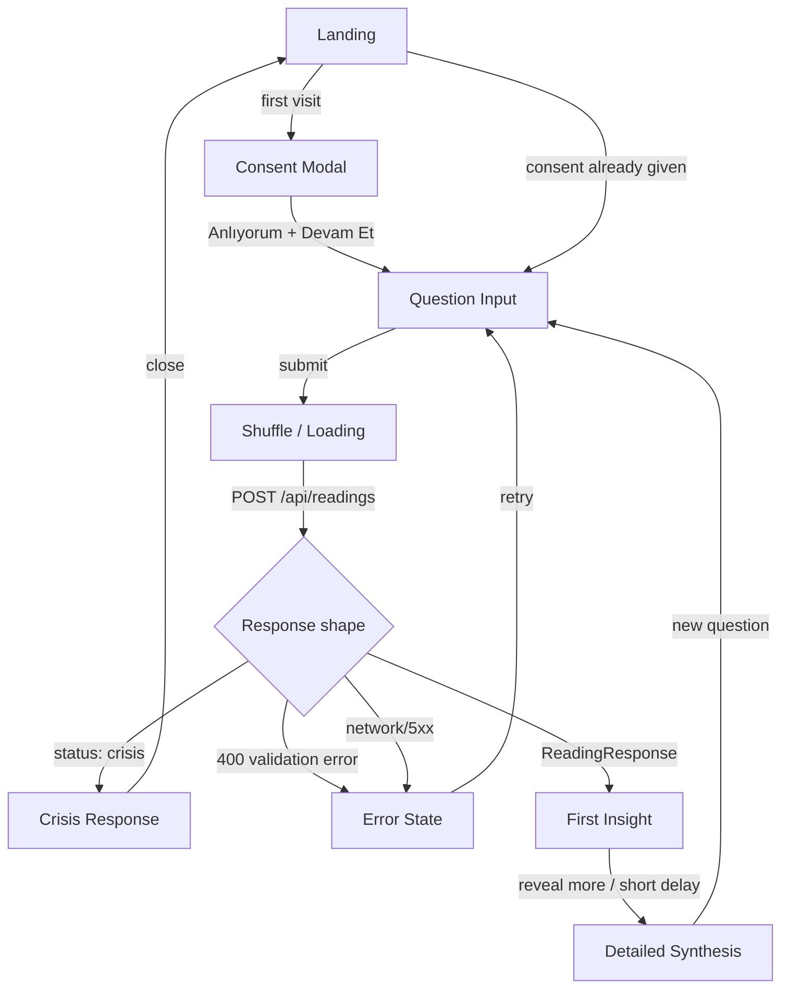

# Sprint 4 — UI Design Contract & Functional Reading Flow: Plan

**Date:** 2026-07-23
**Status:** ✅ APPROVED — implementation in progress
**Governs:** Resolves `docs/UX_DEBT_LOG.md` UX-DEBT-001 (persona mapping); extends ADR-011/ADR-012's ground-truth invariant to the UI layer

---

## 0. Grounding

This plan is written against what already exists, not invented fresh:

- `docs/AŞAMA_2_WIREFRAME_SPEC.md` — 9-screen core flow, exact timing budget (Time to First Insight ≤90s, Core Flow ≤120s), accessibility criteria (44×44px targets, 4.5:1 contrast, `prefers-reduced-motion`), the "No Magic" test ("if this screen disappeared, would the experience break? If no, remove it").
- `docs/AŞAMA_2_PERSONA_WIREFRAME_PATHS.md` — the OLD 5-persona taxonomy with exact tone/word-count targets, which this plan reconciles with the Intake Engine's taxonomy (§1 below).
- `docs/02-ETHICAL_CONSTITUTION.md` — exact, locked copy for the consent modal, the crisis response flow, and the result disclaimer. This plan quotes these verbatim rather than paraphrasing — they are not this sprint's to rewrite.
- `docs/MVP_PLAN_REVISED.md` Aşama 3 — already decided: Tailwind only (no CSS Modules), Inter (sans) + Playfair Display (serif headings), 4px spacing grid, `prefers-color-scheme: dark` + manual toggle. **No hex palette was ever locked** — `docs/05-VISUAL_CONSTITUTION.md`'s color palette is scoped explicitly to card *artwork* generation, not app UI, per its own text. This plan does not invent one either (§5).
- `src/types/api.ts`, `interpretation.ts`, `knowledge.ts`, `intake.ts` — the actual, already-built response shapes this UI must render. Not aspirational — these are the real Zod schemas from Sprint 3.
- `src/app/page.tsx` — the existing functional shell (idle/loading/success/crisis/error), which already discriminates on `ReadingResponse` vs `CrisisResponse`. This plan extends it, not replaces its architecture.

**One structural mismatch surfaced by this grounding, resolved below (§1):** the wireframe spec's "Card Selection (tap 3 or 5)" screen assumes the user picks specific cards. The actual backend (`drawCards()`, Sprint 1) is fully seed-deterministic — there is no API parameter for "which cards the user tapped." Resolution: the Shuffle/Reveal screen is a ritual interaction (tap to shuffle, a fresh seed is generated at that moment), not a card-picking mechanism — consistent with how physical tarot shuffling works (the ritual is the user's, the fall of the cards is the deck's), and requires no API change.

---

## 1. Persona Mapping (resolves UX-DEBT-001)

The wireframe's 5 archetypes describe *enduring user types* for copy-writing purposes. The Intake Engine's 5 values describe *this session's* framing need (`src/types/intake.ts`'s own doc comment: "session-scoped, not an enduring label"). They were never meant to be the same list — but nothing tested the mapping until now.

| Wireframe archetype | Intake `persona` | Secondary axis | Resolution note |
|---|---|---|---|
| First-Time User | `curious-explorer` | `spiritualPreference: balanced` (default) | Direct match — "no tarot experience, asks 'what does this mean'" is exactly `curious-explorer`'s keyword definition |
| Regular Practitioner | `experienced-practitioner` | `responseDepth: deep` (already the engine's default for this persona) | Direct match |
| Highly Anxious User | `emotionally-overwhelmed` **when** `emotionalIntensity: high` | Otherwise: `reflection-seeking`, UI shows a gentler tone anyway when `emotionalIntensity: medium` | The wireframe's "anxious" band is broader/milder than the backend's `emotionally-overwhelmed`, which requires strong keyword evidence. `emotionalIntensity` (already a separate `IntakeContext` field) is the right signal for tone softening at *any* persona, not persona alone. |
| Decision-Maker | `decision-seeking` | `decisionUrgency: medium/high` | Direct match |
| Curious Skeptic | `reflection-seeking` **+** `spiritualPreference: psychological` | — | **Resolves the exact ambiguity `UX_DEBT_LOG.md` flagged** ("unclear whether Curious Skeptic maps to curious-explorer or reflection-seeking"). The wireframe conflated two things the new system correctly separated: a persona axis and a symbolic-vs-psychological framing axis. "Skeptic" was never really a *persona* — it's `reflection-seeking` framed psychologically. This is why it doesn't collide with First-Time User's `curious-explorer` despite both being about "newness/curiosity." |

**Word count → `responseDepth`** (replaces the old per-persona word count with the engine's own already-computed field):

| `responseDepth` | Target length | Old equivalent |
|---|---|---|
| `brief` | ~180 words | Anxious (180) |
| `standard` | ~200–220 words | Regular (200), Decision-Maker (200), Skeptic (220) |
| `deep` | ~250 words | First-Timer (250, contradicts old "longer for beginners" — see note) |

**Note on one inversion:** the old wireframe gave first-timers the *longest* copy (250 words, "more educational"). The new engine's `scoreResponseDepth()` gives `experienced-practitioner` the *deep* (longest) tier and defaults everyone else to `standard`. This is a real tone-philosophy difference, not a bug: the new design bets that explanation-heavy copy serves *depth-seeking* users (experienced practitioners who want more, not less), while newcomers get calibrated `standard` length and lean on symbolic clarity rather than length. **Flagging this as a deliberate product decision to confirm, not something I've silently resolved** — if the intent was "give first-timers more words to explain basics," that needs its own persona-aware exception, which the engine doesn't currently have.

**Test obligation (per UX-DEBT-001 item 3):** a test asserting every `Persona` value has exactly one resolved tone/length treatment — no persona falls through to an undefined UI state. See §7.

---

## 2. Screen Inventory

Scoped to what the **real, already-built API** supports — not the full 9-10 screen wireframe. Screens requiring persistence (Helpfulness Rating, Save Prompt) or monetization (Premium Modal) are explicitly excluded from Sprint 4's functional shell and deferred (§8), per instruction.

| # | Screen/State | Maps to wireframe screen | New in Sprint 4? |
|---|---|---|---|
| 1 | Landing | Landing | Redesign of existing `/` |
| 2 | Consent Modal | (implicit, Ethical Constitution) | New — currently missing entirely |
| 3 | Question Input (topic hint buttons + free-text question) | Topic Selection + Persona/Intake merged | Replaces existing bare `<textarea>` |
| 4 | Shuffle (ritual + loading) | Card Selection + Shuffle merged (per §0 resolution) | New |
| 5 | First Insight (opening + 3 cards + per-card relevance) | First Insight | Redesign of existing success section |
| 6 | Detailed Synthesis (practicalReflection + patterns + uncertaintyNotice + disclaimer) | Detailed Synthesis | New — currently all shown in one block |
| 7 | Crisis Response | (Ethical Constitution Crisis Modal) | Redesign of existing crisis section, verbatim copy |
| 8 | Error State | (not in wireframe) | Redesign of existing error section |
| 9 | Empty/Validation guidance | (not in wireframe) | New — soft placeholder guidance, not a hard block (an empty question is a legitimate, already-tested Intake case) |

**Diagnostic indicators (not separate screens — inline elements within #5/#6):**
- Narration fallback badge (`provider === 'mock'`) — already exists in the current shell, carried forward
- Knowledge status badge (`knowledge.meta.status === 'partial' | 'fallback'`) — new, same visual treatment tier as the narration badge

---

## 3. User Flow Diagram



**KPI checkpoint alignment:** "Time to First Insight" is measured from Question Input submit to screen H rendering — unchanged target, ≤90s. Screens D+E round-trip is the entire measured interval (no client-side card-selection delay to budget for anymore, since §0 removed that step — if anything this makes the ≤90s target *easier* to hit than the original wireframe assumed).

---

## 4. Response-State Matrix

Every distinguishable server response, and its required UI treatment. This is the table that makes "hide fallback status from diagnostics" and "never render tarot content during crisis" enforceable, not aspirational.

| Response shape | Discriminator | Screen | Tarot content shown? | Diagnostic visibility |
|---|---|---|---|---|
| Normal reading, Claude succeeded | `provider === 'claude'`, `knowledge.meta.status === 'resolved'` | First Insight → Detailed Synthesis | Yes | None needed — everything nominal |
| Normal reading, knowledge partial | `knowledge.meta.status === 'partial'` | First Insight → Detailed Synthesis | Yes | Subtle badge near Detailed Synthesis: knowledge context was incomplete for this reading (not alarming — proof-of-concept bundle intentionally has gaps, per Sprint 3) |
| Normal reading, knowledge fallback | `knowledge.meta.status === 'fallback'` | First Insight → Detailed Synthesis | Yes, deterministic-only (no pair-relation flavor) | Same badge tier as partial, slightly more specific copy ("bağlam kaynağına şu an ulaşılamadı") — **never** shown as an error, since the reading itself is still valid and safe |
| Normal reading, narration fallback | `provider === 'mock'` | First Insight → Detailed Synthesis | Yes (Mock-generated, still real card data) | Existing badge, carried forward: "(Bu okuma yedek modda üretildi.)" |
| Crisis short-circuit | `status === 'crisis'` (CrisisResponse — structurally has no `cards`/`interpretation` field at all) | Crisis Response | **Never** — the component receiving this data has no prop through which card/interpretation data could even reach it (see §5, `CrisisNotice`'s type-level contract) | N/A — this *is* the diagnostic; nothing to hide, nothing else to show |
| 400 validation error | HTTP status 400, `{ error: 'invalid_request' \| 'invalid_json_body' }` | Error State | No | Generic apology copy — never surface Zod's raw `.issues` array to the end user (that's for logs/dev tools only) |
| Network failure / unexpected 5xx | fetch throws, or non-OK with unrecognized shape | Error State | No | Same generic copy + "Bağlantı hatası oluştu" (existing copy, carried forward) |

**Binding rule from this matrix:** knowledge `partial`/`fallback` and narration `provider: mock` are **never** treated as errors and never block the reading from displaying — they are visibility requirements, not failure states. Only the two bottom rows (validation error, network failure) constitute an actual Error State screen.

---

## 5. Component Contract

Prop-level contracts, not full implementations. Each constraint below is meant to be enforceable by TypeScript's type system first, tests second — not by convention.

```typescript
// ConsentModal - static content only. No props carrying dynamic copy;
// text is the Ethical Constitution's exact modal text (§0), not
// paraphrased or regenerated per render.
interface ConsentModalProps {
  onAccept: () => void;
  onDecline: () => void;
}

// QuestionForm - the ONLY component that constructs a request body. It
// sends exactly { seed, question, topicHint? } - it has no field, prop,
// or state slot for persona/confidence/safetyFlags, so there is no
// mechanism by which a client-supplied IntakeContext could ever be sent
// (this is the UI-side mirror of the API's own request-schema guarantee).
interface QuestionFormProps {
  onSubmit: (input: { question: string; topicHint?: QuestionDomain }) => void;
  disabled: boolean; // true during Shuffle/Loading
}

// ShuffleReveal - purely presentational + a seed generator. Never computes
// which cards will appear (that's the server's job) - it has no access to
// card data at all until the response arrives.
interface ShuffleRevealProps {
  isLoading: boolean;
  reducedMotion: boolean; // from `prefers-reduced-motion`, instant reveal if true
}

// ReadingResult - renders reading.cards in the exact order the array
// arrives in. No client-side sort/reorder logic exists anywhere in this
// component - the array index IS the display order.
interface ReadingResultProps {
  cards: DrawnCard[]; // rendered strictly in array order
  interpretation: InterpretationOutput;
  knowledgeMeta: KnowledgeResolutionMeta;
  providerUsed: string;
}

// CardNarrationItem - one card's display. Receives only what it needs to
// render; no access to the full response, no access to raw safetyFlags.
interface CardNarrationItemProps {
  position: CardPositionKey;
  cardId: string;
  orientation: 'upright'; // ADR-002 - the type itself has no 'reversed' variant
  narration: CardNarration;
}

// DiagnosticBadge - the ONE component allowed to render knowledge/provider
// status. Takes an enum, not a free string, so copy can't drift per call site.
interface DiagnosticBadgeProps {
  kind: 'knowledge-partial' | 'knowledge-fallback' | 'narration-fallback';
}

// CrisisNotice - structurally cannot receive tarot content. There is no
// `cards` or `interpretation` prop on this interface - if a future
// developer tried to pass reading data in, it would be a type error, not
// a rendering choice someone has to remember to avoid.
interface CrisisNoticeProps {
  message: string; // from CrisisResponse.message - already the Ethical Constitution's exact copy, server-side
  resources: Array<{ label: string; contact: string }>;
}

// ErrorNotice - generic only. Takes a user-safe message, never the raw
// Zod issues array or a stack trace.
interface ErrorNoticeProps {
  userMessage: string;
  onRetry: () => void;
}

// DisclaimerFooter - static, fixed copy (Ethical Constitution's "Result
// Disclaimer"), rendered on every First Insight / Detailed Synthesis
// screen. Not sourced from the API response - a UI-level constant,
// same "never provider-controlled" principle as uncertaintyNotice.
type DisclaimerFooterProps = Record<string, never>; // no props - the text never varies
```

**Claude implementation constraints, restated as component-contract rules** (per your instruction, so they survive past this document into actual code review):
- Do not invent new props beyond what's listed above without updating this contract first.
- `ConsentModalProps` / `CrisisNoticeProps` / `DisclaimerFooterProps` text must be copy-pasted verbatim from `docs/02-ETHICAL_CONSTITUTION.md` (quoted in full in §0's source material) - not paraphrased, not "improved."
- No component may hold its own `fetch` call except the page-level orchestrator that owns `ViewState` (unchanged from the existing `src/app/page.tsx` architecture) - components receive data via props, they don't independently query the API.

---

## 6. Design Tokens Proposal

**Per instruction ("Do not invent a production visual identity"), this proposes token *structure and naming*, not a brand palette.** Aşama 3's already-locked decisions (Tailwind, Inter + Playfair Display, 4px grid) are honored below; no hex value here is a real brand color — every color is a semantic placeholder pending an actual Canva/Figma lock.

```typescript
// tailwind.config.ts additions (structure, not final values)
const tokens = {
  fontFamily: {
    heading: ['Playfair Display', 'serif'], // Aşama 3, already locked
    body: ['Inter', 'sans-serif'],           // Aşama 3, already locked
  },
  spacing: {
    // 4px grid, Aşama 3 already locked
    1: '4px', 2: '8px', 3: '12px', 4: '16px', 6: '24px', 8: '32px',
  },
  colors: {
    // PLACEHOLDER semantic names - real values pending design lock.
    // Deliberately grayscale/neutral so nobody mistakes these for
    // approved brand colors.
    surface: { base: '#fafafa', raised: '#ffffff' },     // TBD
    text: { primary: '#1a1a1a', muted: '#6b6b6b' },       // TBD
    accent: { primary: '#4a4a4a' },                       // TBD - NOT card-art gold/burgundy (05-VISUAL_CONSTITUTION.md's palette is scoped to card illustrations, not reused here without a deliberate decision to do so)
    diagnostic: { subtle: '#e8e8e8', subtleText: '#555555' }, // knowledge/narration fallback badges - deliberately low-alarm
    crisis: { surface: '#fff5f5', accent: '#8b3a3a' },    // the one place a warmer/serious tone is appropriate - still TBD exact value
  },
  motion: {
    // Aşama 3: "<300ms" animation principle
    shuffle: '280ms',
    reveal: '200ms',
    reducedMotion: '0ms', // prefers-reduced-motion: reduce -> instant, per wireframe spec
  },
};
```

**Explicitly not decided here:** actual brand hex values, logo, iconography set (Aşama 3 named "Feather Icons + custom" but chose no icons yet), dark mode token overrides. These need the Canva/Figma prototype the earlier plan called for, not code.

---

## 7. Acceptance Criteria

Sprint 4 closes when:

**Build gates (unchanged):** `npm install`, `npm run lint`, `npm run typecheck`, `npm run test`, `npm run build` all clean.

**Contract-specific:**
1. Every row of the Response-State Matrix (§4) has a corresponding rendered UI state, verified by test - not just described here.
2. The persona mapping table (§1) has a test asserting all 5 `Persona` values resolve to exactly one tone/length treatment (the UX-DEBT-001 "no drift" guarantee).
3. `CrisisNoticeProps` contains no field capable of carrying card/interpretation data - a TypeScript-level guarantee, checked by `typecheck`, not just this document's prose.
4. Knowledge `partial`/`fallback` and narration `provider: mock` never produce an Error State screen - verified by test (feed each into the shell, assert it's NOT the error/crisis component).
5. All touch targets ≥44×44px, text contrast ≥4.5:1 (normal) / ≥3:1 (large), verified by a manual Lighthouse/axe pass (automated a11y testing is a nice-to-have, not blocking this sprint - flagged, not silently assumed done).
6. `prefers-reduced-motion` makes the Shuffle screen's reveal instant - verified by test with the media query mocked.
7. The Consent Modal and Result Disclaimer render the Ethical Constitution's exact text, verified by a snapshot/string-equality test against the quoted source (§0) - not a "looks about right" review.
8. No component constructs its own request body beyond `QuestionFormProps.onSubmit`'s shape - verified by grep/structural test, same technique used for `KnowledgeProvider`'s "no import of deck.ts" guarantee in Sprint 3.

---

## 8. Test Matrix

| # | Test | Verifies |
|---|---|---|
| 1 | Each of the 5 pipeline outcomes (resolved/partial/fallback-knowledge/fallback-narration/crisis) from Sprint 3's evidence report renders a distinct, correct screen | Response-State Matrix is real, not aspirational |
| 2 | 400 response renders Error State, not a crash or blank screen | Validation-error path has a UI home |
| 3 | Network-level fetch rejection renders Error State with retry | Existing behavior, re-verified after refactor |
| 4 | All 5 `Persona` values resolve to a defined tone/length via the mapping table | UX-DEBT-001 closure test |
| 5 | "Curious Skeptic" input (persona: `reflection-seeking`, spiritualPreference: `psychological`) renders distinctly from plain `reflection-seeking` + `balanced` | The two-axis resolution (§1) actually changes rendered copy, not just documented intent |
| 6 | `CrisisNoticeProps` cannot structurally accept a `cards` or `interpretation` field (TS compile-time check, e.g. a `// @ts-expect-error` test fixture) | Type-level enforcement, not convention |
| 7 | Knowledge `partial` and `fallback` statuses both render the reading normally, with only the badge differing | Never treated as an error |
| 8 | Narration fallback (`provider: mock`) still renders full reading content | Existing guarantee, re-verified |
| 9 | Consent modal text exact-matches the Ethical Constitution's quoted copy | No silent copy drift |
| 10 | Result Disclaimer text exact-matches the Ethical Constitution's "Result Disclaimer" quoted copy | Same |
| 11 | Crisis screen's rendered resources exactly match the 4 resources from `route.ts`'s `CRISIS_RESOURCES` (already tested at the API layer in Sprint 3 - this test checks the UI actually displays what the API sent, not a hardcoded UI copy of the same list) | No UI/API resource-list drift |
| 12 | `prefers-reduced-motion: reduce` mocked true -> shuffle reveal duration is 0/instant | Accessibility requirement enforced, not just styled |
| 13 | Keyboard-only navigation can reach and activate: topic hint buttons, question textarea, submit button, consent accept/decline | Wireframe's keyboard-nav criterion |
| 14 | `QuestionFormProps.onSubmit` payload shape contains only `question`/`topicHint` keys, never anything persona/safety-related, across a fuzz of form states | Mirrors Sprint 3's server-side "cannot smuggle IntakeContext" guarantee, now on the client |
| 15 | Full submit → First Insight → Detailed Synthesis flow completes end-to-end against a mocked `/api/readings`, for at least one case per response-state row | End-to-end confidence, same spirit as Sprint 3's `api-readings.test.ts` |

---

## 9. Explicitly Deferred (Sprint 4 dışı, restated here for one source of truth)

- Üyelik, ödeme, Premium Modal
- Persistence-dependent screens: Helpfulness Rating, Save Prompt (designed conceptually in §2's table, not built - nowhere to persist to yet)
- Full animation system beyond the `<300ms` shuffle/reveal budget
- Large knowledge dataset / NotebookLM automation (Sprint 5, per your proposed order)
- Production branding - all hex values in §6 are placeholders, not a locked identity
- Automated accessibility test tooling (axe-core or similar) - manual pass only, gap flagged in §7 item 5

---

## Next Step

**Approved 2026-07-23, both open questions resolved:**
- §1's inversion: **engine stays as-is** — `deep` responseDepth remains `experienced-practitioner`'s tier, no persona-aware exception added for `curious-explorer`/first-timers. The new tone philosophy (depth-seekers get more, newcomers get `standard` length with symbolic clarity) is confirmed intentional, not a gap to patch.
- §6's token approach: **placeholder/structural only, confirmed** — no real brand colors this sprint; semantic token naming and grayscale/neutral values stand as specified.

Implementation proceeds per this plan.
