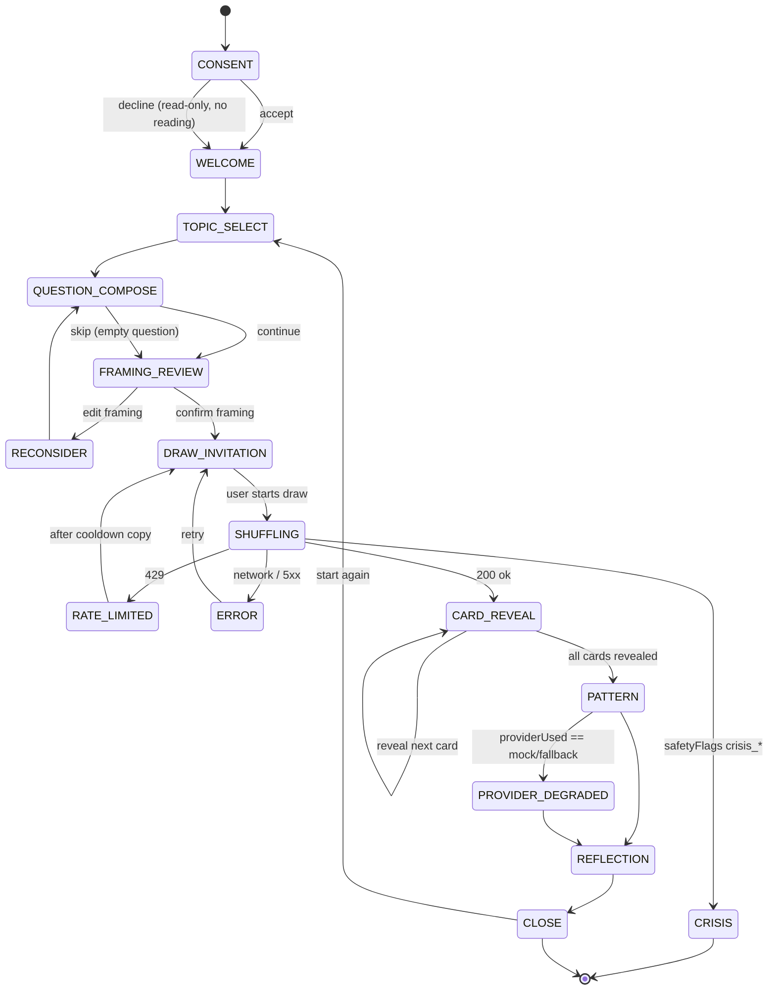

# UX Flow V2 — Insight Engine Session Flow Contract

**Status:** DRAFT — AWAITING PRODUCT OWNER REVIEW
**Scope:** Documentation only. This document defines the *target* interaction flow and its state model. It changes no runtime code, promotes no KnowledgeBundle, starts no S4 persistence work, and does not alter crisis-resource numbers. It is the governing contract that later coded UI slices must satisfy — not an implementation.
**Branch verified:** `claude/insight-engine-investor-audit-bkofgr` (HEAD `95b68f6`)
**Companion:** `docs/UX_COPY_CONTRACT.md` (exact user-facing strings)
**Supersedes for flow purposes:** the single-screen orchestration in `src/app/page.tsx` and the flat form in `src/components/QuestionForm.tsx` — both are named below as the migration source.

---

## 0. Why this document exists

The current interface (self-assessed ~4/10) does two things that cap its quality:

1. **`QuestionForm.tsx`** offers only three topic chips and one flat textarea. There is no question *guidance* — the user is left to phrase a question with no scaffolding, and the product silently classifies it server-side with no chance for the user to see or correct that framing.
2. **`ReadingResult.tsx`** renders every interpretation layer at once — opening, three card narrations, patterns, practical reflection, uncertainty notice — as a single wall. The user has no control over pacing and no single moment of arrival.

The Product Owner's binding priority order for closing this gap is, verbatim:

> **Soru rehberliği → çerçeveleme onayı → kullanıcı kontrollü kart açılımı → ana örüntü ekranı → tek yansıtma sorusu → görsel polish.**

Explicitly **not** the starting point: color, logo, card animation, shadows, gradients. The largest quality jump is functional flow, not visual polish. This document encodes that order as the build sequence (§7).

The research, safety, and no-invented-symbol boundaries of the project are the **base contract** of this UX design and must survive every screen below.

---

## 1. Priority order → flow stages

| # | Product Owner priority phrase | Flow stage (this doc) | Primary artifact today | Target |
|---|---|---|---|---|
| 1 | Soru rehberliği | `QUESTION_GUIDANCE` | `QuestionForm.tsx` (flat) | Guided topic + intent scaffolding, still optional/skippable |
| 2 | Çerçeveleme onayı | `FRAMING_REVIEW` | none (server-only, invisible) | User sees & confirms how the question was framed **before** any draw |
| 3 | Kullanıcı kontrollü kart açılımı | `CARD_REVEAL` | `ShuffleReveal.tsx` (auto) | User-paced, one card at a time, user triggers each reveal |
| 4 | Ana örüntü ekranı | `PATTERN` | buried in `ReadingResult` synthesis block | A dedicated arrival screen: the one pattern across the three cards |
| 5 | Tek yansıtma sorusu | `REFLECTION` | `interpretation.uncertaintyNotice` inline | One single reflective question, alone, that closes the session |
| 6 | Görsel polish | (cross-cutting, last) | Tailwind classes inline | Deferred; a separate visual pass after 1–5 are functional |

---

## 2. State model (V2)

The current `ViewState` in `src/app/page.tsx` has 6 states:
`consent | idle | loading | success | crisis | error`.

V2 expands this into an explicit **16-state** session model. The additional states are what make the flow *paced* rather than a single request→dump. States are grouped by phase.

### 2.1 State list

| # | State | Phase | Terminal? | Notes |
|---|---|---|---|---|
| 1 | `CONSENT` | entry | no | Unchanged. `ConsentModal.tsx`. Gate before anything else. |
| 2 | `WELCOME` | entry | no | Post-consent landing. Sets expectation ("reflection, not prophecy"). |
| 3 | `TOPIC_SELECT` | guidance | no | Topic cards (relationship / career / self), each optional. |
| 4 | `QUESTION_COMPOSE` | guidance | no | Guided free-text with intent prompts; skippable → empty question allowed. |
| 5 | `FRAMING_REVIEW` | guidance | no | Shows the derived framing; user **confirms** or **edits back**. |
| 6 | `DRAW_INVITATION` | reveal | no | "Ready to draw?" — the user, not a timer, starts the draw. |
| 7 | `SHUFFLING` | reveal | no | The former `loading`. Request in flight. `ShuffleReveal.tsx`. |
| 8 | `CARD_REVEAL` | reveal | no | Cards resolved; revealed **one at a time, user-triggered**. |
| 9 | `PATTERN` | insight | no | The single cross-card pattern (arrival screen). |
| 10 | `REFLECTION` | insight | no | One reflective question. Session's emotional close. |
| 11 | `CLOSE` | insight | yes* | Disclaimer + "start again". *Terminal for the reading, not the app. |
| 12 | `CRISIS` | safety | yes | Short-circuit. No cards, no narration. `CrisisNotice.tsx`. |
| 13 | `RATE_LIMITED` | error | no | 429 from the API. Distinct from generic error. |
| 14 | `PROVIDER_DEGRADED` | insight | no | Narration came from fallback/mock; cards & seed intact (see §4). |
| 15 | `ERROR` | error | no | Generic recoverable failure. `ErrorNotice.tsx`. |
| 16 | `RECONSIDER` | guidance | no | User chose "edit framing" from `FRAMING_REVIEW`; returns to compose with context preserved. |

### 2.2 Diagram

### 2.3 Relationship to current code

- The V2 model is a **superset** of today's `ViewState`. `loading→SHUFFLING`, `success→CARD_REVEAL/PATTERN/REFLECTION/CLOSE`, `crisis→CRISIS`, `error→ERROR/RATE_LIMITED`, `idle→WELCOME/TOPIC_SELECT`.
- No new API field is required for stages 1–6. The API contract (`POST /api/readings`, body `{ seed, question, topicHint }`) is unchanged. The added states are **client-side pacing**, derived from the same single response.
- `FRAMING_REVIEW` (stage 5) is the one stage that surfaces something the server already computes but never shows: the derived `intakeContext` framing. It is display-and-confirm only; **the client still never sends `IntakeContext` fields** — the QuestionForm invariant in `QuestionForm.tsx:18-25` (payload is exactly `{ question, topicHint? }`) is preserved. See §5.

---

## 3. Per-stage screen contracts

Exact strings live in `docs/UX_COPY_CONTRACT.md`; this section defines *behavior and structure*.

### 3.1 `QUESTION_GUIDANCE` (stages TOPIC_SELECT + QUESTION_COMPOSE) — priority #1

- Topic cards replace the three flat chips. Each card carries a one-line "what this is good for" cue. Selection stays optional and toggleable (matches current `topicHint` optionality).
- The compose step offers **intent scaffolding** — short prompts that help a user turn a vague worry into a reflective question — but the textarea remains **skippable**: an empty question must still produce a valid reading (current placeholder already says "boş da bırakabilirsiniz").
- **Hard boundary:** the guidance never promises an answer, a yes/no, or a prediction. It nudges toward *reflective* phrasing only. Banned copy patterns in `UX_COPY_CONTRACT.md` apply here.
- Payload shape unchanged: `{ question, topicHint? }`.

### 3.2 `FRAMING_REVIEW` — priority #2

- After compose, before any draw, the user sees a plain-language restatement of how their question was framed (topic + reflective intent). This is the "çerçeveleme onayı" step.
- Two actions: **Confirm** (→ `DRAW_INVITATION`) or **Edit** (→ `RECONSIDER` → `QUESTION_COMPOSE`, prior input preserved).
- **Governance note:** the derived `IntakeContext` (persona, `emotionalIntensity`, `decisionUrgency`, `confidence`, `safetyFlags`) is computed server-side today by `classifyIntake`. V2 may surface a *human-readable framing label only* (like `ReadingResult`'s existing `profile.framingLabel` via `resolvePersonaProfile`). It must **not** expose raw diagnostic fields, confidence numbers, or safety flags to the user — those stay internal (see §6). Whether `FRAMING_REVIEW` needs a lightweight preview endpoint or can reuse the existing response is an implementation question deferred to the coded slice; the contract only requires that no new client→server IntakeContext field is introduced.

### 3.3 `CARD_REVEAL` — priority #3

- Cards arrive already resolved and **ordered** by the Reading Engine. The UI renders them in array order — the existing invariant in `ReadingResult.tsx:18-23` (array index *is* display order, no client sort) is carried forward unchanged and extended to the paced reveal.
- Reveal is **user-triggered**: one card at a time, the user taps to turn the next. `ShuffleReveal.tsx` (currently auto/loading-driven) evolves from a spinner into a user-paced reveal surface. `prefers-reduced-motion` continues to be honored (current `page.tsx:30-39` media-query wiring is the reference).
- No card may be reordered, added, dropped, or re-drawn by the reveal interaction. The user controls *pacing*, never *content*.

### 3.4 `PATTERN` — priority #4

- A dedicated arrival screen carrying the single cross-card synthesis: `interpretation.patterns` + `interpretation.practicalReflection` (existing fields). Today these are buried at the bottom of the `detailed-synthesis` block; V2 promotes them to their own moment.
- This is the emotional peak of the session — one clear "here is the thread across your three cards," not a list dump.

### 3.5 `REFLECTION` — priority #5

- Exactly **one** reflective question, presented alone, closing the session. Sourced from `interpretation.uncertaintyNotice` / a dedicated reflective-prompt field (a copy-contract concern, see companion doc §6).
- No "what next," no upsell, no saved-reading CTA (that would be S4; out of scope, §6).

### 3.6 Visual polish — priority #6 (deferred)

- Color system, logo, card artwork, motion refinement, shadows/gradients are a **separate later pass** after stages 1–5 are functional. This document does not specify them. The 3-card visual pilot (Fool / Hermit / Star) remains the asset scope per the approved plan; nothing here expands it.

---

## 4. Provider-failure recovery (binding rule)

The Reading Engine is the sole card-selection authority (ADR-011/012); LLM providers are narration-only. This has a direct UX consequence that V2 must honor:

> **A narration/provider failure must never discard the drawn cards or the seed.** On provider degradation the session keeps the same cards, in the same order, from the same seed, and only the *narration* is re-derived (fallback/mock) or retried. The user never loses their draw because a language model hiccupped.

- State `PROVIDER_DEGRADED` (14) exists for exactly this: cards + pattern are shown, with a hidden-by-default diagnostic that narration used a fallback path (`providerUsed === 'mock'`, or `fallbackReason` present in the response).
- "Retry" from an `ERROR` state after cards were already resolved must re-narrate against the **same seed**, not draw a new spread.

---

## 5. Invariants carried forward from current code

These are existing guarantees the V2 flow must not weaken:

1. **Client never sends IntakeContext.** Request body stays exactly `{ seed, question, topicHint? }` (`QuestionForm.tsx:18-25`, `page.tsx:48`). No persona/confidence/safetyFlags slot is added client-side, including in `FRAMING_REVIEW`.
2. **No client-side card reorder.** Array order is display order (`ReadingResult.tsx:18-23`). The paced reveal iterates the array; it does not sort it.
3. **Crisis short-circuits everything.** A `status: 'crisis'` response (safetyFlags `crisis_*`) skips cards and narration entirely (`page.tsx:56-58`, gate at `src/app/api/readings/route.ts`). No V2 pacing state sits between the crisis response and `CrisisNotice.tsx`.
4. **Single fetch owner.** The orchestrator is the only caller of `fetch('/api/readings')` (`page.tsx:44-49`). Refactoring `page.tsx` into a session provider/router must keep exactly one API caller.
5. **Reduced-motion honored.** The paced reveal must respect `prefers-reduced-motion` (`page.tsx:30-39`).

---

## 6. Explicitly out of scope for this flow

These are named to prevent scope creep during the coded slices:

- **S4 persistence** — reading history, saved readings, "memory center," consented save, durable same-question cooldown. All blocked until S2 live-eval completes and gate **G1** passes. `REFLECTION`/`CLOSE` must **not** grow a save/history CTA in V2.
- **Crisis-resource numbers.** `src/app/api/readings/route.ts` currently carries `155` (Polis), a private İntihar Önleme number, `183`, and `112`. Correcting these is a **separate, reviewed safety-remediation task** verified against current official sources (`https://www.112.gov.tr/`, ALO 183). V2 flow **does not change any crisis number**; `CrisisNotice.tsx` renders whatever the (separately corrected) gate provides.
- **Diagnostic transparency to users.** `confidence`, `safetyFlags`, raw persona, and `providerUsed` remain **internal diagnostics** surfaced only through hidden-by-default `DiagnosticBadge` affordances (`DiagnosticBadge.tsx`), never as user-facing framing copy.
- **Methodology extraction** — remains on HOLD until its gate; contributes nothing to V2 copy or narration.
- **Visual system / artwork** — deferred to priority #6, separate pass.

---

## 7. Build sequence (coded slices, in priority order)

Each slice is a separate reviewed change **after this contract is approved**. Slices land smallest-first and each keeps all §5 invariants and the full test suite green.

| Slice | Delivers | Touches | Depends on |
|---|---|---|---|
| **S-UX-1** | `QUESTION_GUIDANCE`: topic cards + intent scaffolding (still skippable, payload unchanged) | `QuestionForm.tsx`, new copy from contract | contract approval |
| **S-UX-2** | `FRAMING_REVIEW` + `RECONSIDER`: confirm/edit framing before draw (display-only, no new client field) | orchestrator, framing-label reuse | S-UX-1 |
| **S-UX-3** | `CARD_REVEAL`: user-paced one-at-a-time reveal, reduced-motion safe, no reorder | `ShuffleReveal.tsx`, orchestrator | S-UX-2 |
| **S-UX-4** | `PATTERN`: dedicated cross-card arrival screen | split from `ReadingResult.tsx` | S-UX-3 |
| **S-UX-5** | `REFLECTION` + `CLOSE`: single reflective question, no upsell | split from `ReadingResult.tsx` | S-UX-4 |
| **S-UX-6** | Orchestrator refactor: `page.tsx` → session provider + screen router with the 16-state model | `page.tsx` | can interleave; must preserve single fetch owner |
| **S-UX-7** | Visual polish pass (color/logo/motion) | cross-cutting | after S-UX-1..5 functional |

Recommended first coded slice: **S-UX-1** (question guidance) — the highest-value, lowest-risk change, and the exact top of the Product Owner's priority order.

---

## 8. Approval

This is a contract, not an implementation. No code changes accompany it.

- **Reviewed by:** ____________________  **Date:** ____________
- **Decision:** PENDING
- On approval: begin **S-UX-1** as a separate reviewed change; keep `docs/UX_COPY_CONTRACT.md` as the binding source for all user-facing strings.
