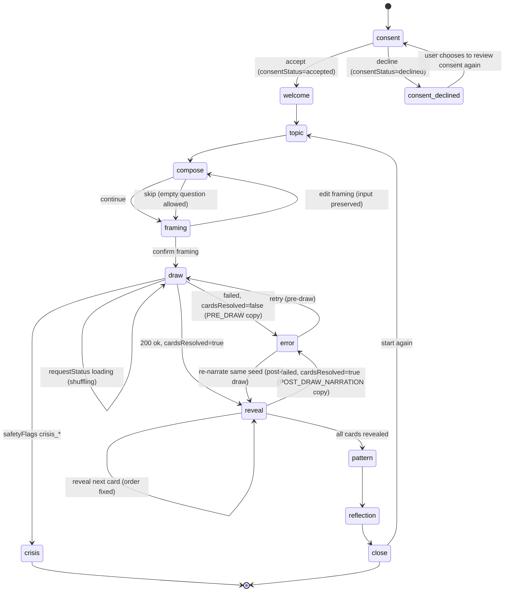

# UX Flow V2 — Insight Engine Session Flow Contract

**Status:** DRAFT — AWAITING PRODUCT OWNER REVIEW (revised per PO review, 2026-07-24)
**Scope:** Documentation only. This document defines the *target* interaction flow and its screen/metadata model. It changes no runtime code, promotes no KnowledgeBundle, starts no S4 persistence work, and does not alter crisis-resource numbers. It is the governing contract that later coded UI slices must satisfy — not an implementation.
**Branch verified:** `claude/insight-engine-investor-audit-bkofgr` (HEAD `6ceb3f1`)
**Companion:** `docs/UX_COPY_CONTRACT.md` (exact user-facing strings)
**Supersedes for flow purposes:** the single-screen orchestration in `src/app/page.tsx` and the flat form in `src/components/QuestionForm.tsx` — both are named below as the migration source.

---

## 0. Why this document exists

The current interface (self-assessed ~4/10) does two things that cap its quality:

1. **`QuestionForm.tsx`** offers only three topic chips and one flat textarea. There is no question *guidance* — the user is left to phrase a question with no scaffolding, and the product silently classifies it server-side with no chance for the user to see or correct that framing.
2. **`ReadingResult.tsx`** renders every interpretation layer at once — opening, three card narrations, patterns, practical reflection, uncertainty notice — as a single wall. The user has no control over pacing and no single moment of arrival.

The Product Owner's binding priority order for closing this gap is, verbatim:

> **Soru rehberliği → çerçeveleme onayı → kullanıcı kontrollü kart açılımı → ana örüntü ekranı → tek yansıtma sorusu → görsel polish.**

Explicitly **not** the starting point: color, logo, card animation, shadows, gradients. The largest quality jump is functional flow, not visual polish. This document encodes that order as the build sequence (§9).

The research, safety, and no-invented-symbol boundaries of the project are the **base contract** of this UX design and must survive every screen below.

---

## 1. Priority order → flow stages

| # | Product Owner priority phrase | Flow screen (this doc) | Primary artifact today | Target | Blocking dependency |
|---|---|---|---|---|---|
| 1 | Soru rehberliği | `topic` + `compose` | `QuestionForm.tsx` (flat) | Guided topic + intent scaffolding, still optional/skippable | none — buildable now (S-UX-1) |
| 2 | Çerçeveleme onayı | `framing` | none (server-only, invisible) | User sees & confirms framing **before** any draw | **UNRESOLVED — see §5.** Blocked on an API-shape decision. |
| 3 | Kullanıcı kontrollü kart açılımı | `reveal` | `ShuffleReveal.tsx` (auto) | User-paced, one card at a time | after S-UX-1..2 |
| 4 | Ana örüntü ekranı | `pattern` | buried in `ReadingResult` synthesis block | A dedicated arrival screen: the one pattern across the three cards | after `reveal` |
| 5 | Tek yansıtma sorusu | `reflection` | (no governed source yet) | One single reflective question | **BLOCKED — needs a governed `reflectionPrompt` field, §6.** |
| 6 | Görsel polish | (cross-cutting, last) | Tailwind classes inline | Deferred; a separate visual pass after 1–5 are functional | after 1–5 |

---

## 2. Model: `Screen` + `SessionMeta` (not a flat "N-state" enum)

A single large state enum was the wrong abstraction — it conflated four different kinds of thing (a screen, a network result, an internal quality signal, and a transition). Screen count is not a quality metric. The model below separates **what the user sees** (`Screen`) from **technical/session facts** (`SessionMeta`), so a network result or a narration-fallback never has to become its own screen.

```ts
type Screen =
  | 'consent'
  | 'consent-declined' // informational only: how-it-works + privacy + return-to-approve; NO reading CTA
  | 'welcome'
  | 'topic'
  | 'compose'
  | 'framing'     // BLOCKED until the §5 architecture decision is made
  | 'draw'
  | 'reveal'
  | 'pattern'
  | 'reflection'  // BLOCKED until the §6 governed reflectionPrompt field exists
  | 'close'
  | 'crisis'
  | 'error';

type SessionMeta = {
  requestStatus: 'idle' | 'loading' | 'resolved' | 'failed';
  narrationStatus?: 'primary' | 'fallback'; // internal only; fallback continues the normal flow (§4)
  cardsResolved: boolean;                    // gates which error copy is honest (§3.7)
  consentStatus: 'pending' | 'accepted' | 'declined';
};
```

Notes on the separation:

- **No `loading`/`shuffling` screen.** "Kartlar hazırlanıyor…" is the `draw` screen with `requestStatus: 'loading'`, not a distinct screen.
- **No `provider-degraded` screen.** A successful narration fallback is `narrationStatus: 'fallback'` and the user proceeds through the normal `reveal → pattern → reflection` path (§4, PO point 5).
- **No `rate-limited` screen.** A 429 is the `error` screen with `requestStatus: 'failed'` and a `rate-limit` reason; its copy differs but it is not a separate screen.
- **`error` is one screen with two honest copy variants**, chosen by `cardsResolved` (§3.7, PO point 3).
- **Editing the framing** returns to the `compose` screen with prior input preserved — it is not its own screen.

### 2.1 Diagram (screens; metadata annotated on edges)



### 2.2 Relationship to current code

- The model is a **superset** of today's `ViewState` (`consent | idle | loading | success | crisis | error`). `loading` → `draw` + `requestStatus:'loading'`; `success` → `reveal`/`pattern`/`reflection`/`close`; `error` → `error` (copy by `cardsResolved`); `crisis` → `crisis`; `idle` → `welcome`/`topic`.
- No new API field is required for screens 1, 3, 4, 6 (`topic`, `reveal`, `pattern`, `close`). The API contract (`POST /api/readings`, body `{ seed, question, topicHint }`) is unchanged for those. The added screens are **client-side pacing**, derived from the same single response.
- Two screens are **blocked** on decisions that are NOT resolved by this document: `framing` (§5) and `reflection` (§6). No code for either begins until its blocker is cleared.

---

## 3. Per-screen contracts

Exact strings live in `docs/UX_COPY_CONTRACT.md`; this section defines *behavior and structure*.

### 3.1 `consent` / `consent-declined` — safety gate (PO point 2)

- `consent` is unchanged (`ConsentModal.tsx`; copy is exact-tested at `src/__tests__/unit/ui-components.test.tsx:13-38`).
- **Decline does NOT flow into the reading path.** The prior draft routed decline into `welcome` while claiming "read-only, no reading," but no downstream screen carried a read-only authority — a declining user could still reach the reading flow. Fixed: decline goes to a dedicated `consent-declined` screen that offers only *how it works*, *privacy*, and *return to review consent*. There is **no reading CTA** on it.
- Reading requires `consentStatus === 'accepted'`. If the product must define a lighter mandatory-consent scope instead, that is a separate reviewed decision — the current contract is: no acceptance, no reading.

### 3.2 `topic` + `compose` (question guidance) — priority #1 — buildable now

- Topic cards replace the three flat chips. Each card carries a one-line "what this is good for" cue. Selection stays optional and toggleable (matches current `topicHint` optionality).
- The compose step offers **intent scaffolding** — short reflective example prompts a user can insert — but the textarea remains **skippable**: an empty question must still produce a valid reading (current placeholder already says "boş da bırakabilirsiniz").
- **Hard boundary:** the guidance never promises an answer, a yes/no, or a prediction. It nudges toward *reflective* phrasing only. Banned copy patterns in `UX_COPY_CONTRACT.md` §3 apply here.
- Payload shape unchanged: `{ question, topicHint? }`.

### 3.3 `framing` (framing review) — priority #2 — **BLOCKED, see §5**

- Intended behavior: before any draw, the user sees a plain-language restatement of how their question was framed and confirms it or edits back.
- This screen cannot be implemented against the current single-POST API without contradicting its own premise (§5). No framing code begins until §5 is resolved.

### 3.4 `reveal` (user-controlled reveal) — priority #3

- Cards arrive already resolved and **ordered** by the Reading Engine. The UI renders them in array order — the existing invariant in `ReadingResult.tsx:18-23` (array index *is* display order, no client sort) is carried forward unchanged and extended to the paced reveal.
- Reveal is **user-triggered**: one card at a time, the user taps to turn the next. `ShuffleReveal.tsx` evolves from a spinner into a user-paced reveal surface. `prefers-reduced-motion` continues to be honored (`page.tsx:30-39` is the reference).
- No card may be reordered, added, dropped, or re-drawn by the reveal interaction. The user controls *pacing*, never *content*.

### 3.5 `pattern` (arrival) — priority #4

- A dedicated arrival screen carrying the single cross-card synthesis: `interpretation.patterns` + `interpretation.practicalReflection` (existing fields), promoted from the bottom of the current `detailed-synthesis` block to their own moment.

### 3.6 `reflection` — priority #5 — **BLOCKED, see §6**

- Intended behavior: exactly **one** reflective question, alone, closing the session.
- There is **no governed source field** for a reflective *question* today. `interpretation.uncertaintyNotice` is an uncertainty *statement*, not a question, and must not be repurposed as one (§6, PO point 4). This screen is blocked until a governed `reflectionPrompt` field is added through the normal governed path (not this sprint).

### 3.7 `error` — one screen, two honest copy variants (PO point 3)

The prior draft sent every failure to one `ERROR` state and promised "açılışın kaybolmaz" ("your draw is not lost") unconditionally. That promise is only true if the cards were already resolved. A network failure *before* the draw has no draw to preserve. Corrected:

| Condition | `cardsResolved` | Copy variant | Promise |
|---|---|---|---|
| Failure before cards resolved (intake/selection/network pre-draw) | `false` | **PRE_DRAW_ERROR** | "Henüz kart seçilmedi. Yeniden deneyebilirsin." — no preservation claim |
| Failure after cards resolved (narration failed / retry) | `true` | **POST_DRAW_NARRATION_ERROR** | "Kartların korundu. Yalnız yorum yeniden hazırlanacak." |

The UI must never tell a user their draw is preserved unless `cardsResolved === true`.

### 3.8 Visual polish — priority #6 (deferred)

- Color system, logo, card artwork, motion refinement, shadows/gradients are a **separate later pass** after screens 1–5 are functional. The 3-card visual pilot (Fool / Hermit / Star) remains the asset scope; nothing here expands it.

---

## 4. Provider-failure recovery (binding rule, corrected per PO point 5)

The Reading Engine is the sole card-selection authority (ADR-011/012); LLM providers are narration-only. Two distinct cases:

1. **Narration fallback succeeded.** The provider degraded but a valid narration was produced (`narrationStatus: 'fallback'`). This is **internal session metadata, not a screen.** The user proceeds through the normal `reveal → pattern → reflection` path. Only if the content is *genuinely* limited may a plain, non-alarming trust note appear — never a separate "degraded" screen.
2. **Narration failed after cards resolved.** Cards + seed are preserved; the user lands on the `error` screen's **POST_DRAW_NARRATION_ERROR** variant (§3.7) and can re-narrate against the **same seed** — never a new spread.

> Binding: a narration/provider failure must never discard the drawn cards or the seed once `cardsResolved === true`.

---

## 5. UNRESOLVED ARCHITECTURE DECISION — framing review vs. the single-POST API (PO point 1)

**This is the central open contradiction and must be resolved before any `framing` code is written.**

The contract says the user confirms the framing *before* the cards are drawn. But the current API is a single `POST /api/readings` that, in one call, runs intake classification **and** card selection **and** narration. If the `framing` screen reuses that existing response, the cards are **already selected** by the time the user reaches the confirm screen — which contradicts "before the draw." The prior draft both claimed "no new API field is needed" and "confirm before draw"; those two statements cannot both hold. That is a flow-contract contradiction, not a detail.

**Decision required — pick exactly one before coding `framing`:**

| Option | What it is | Cost |
|---|---|---|
| **A — separate framing-preview endpoint** *(PO's stated preference)* | A dedicated server-side endpoint that returns only the framing classification, drawing no cards, running no narration. The main `POST /api/readings` still owns the actual draw after confirmation. | Separate architecture + **security review** (must preserve the server-side safety/crisis gate; must not leak diagnostic fields; must keep the "client never sends IntakeContext" invariant). |
| **B — two-phase single endpoint** | `POST /api/readings` becomes two-phase (classify → confirm → draw), e.g. via a phase parameter or a short-lived server token. | API redesign + state/idempotency handling; larger blast radius on existing tests. |
| **C — client-side question summary only** | The `framing` screen shows a *simple summary of the user's own question* (topic + their words), **not** the server's persona/intake classification. No new endpoint. | Weakest product claim: it is not a real "framing review" of how the system will interpret the question. |

**Governance constraints on any option:**
- The client still never sends `IntakeContext` fields (invariant, §7.1). A preview endpoint returns a framing *label*, it does not accept persona/safety input from the client.
- No raw diagnostic fields (`confidence`, `safetyFlags`, raw persona enum) may be shown to the user (§7 / copy §3).
- The server-side crisis short-circuit must remain authoritative regardless of preview.

Until one option is chosen and (for A/B) security-reviewed, **the `framing` screen is documentation only.**

---

## 6. Reflective-question sourcing — needs a governed `reflectionPrompt` field (PO point 4)

The `reflection` screen needs exactly one reflective *question*. The only near-fit field today is `interpretation.uncertaintyNotice` (`src/types/interpretation.ts:44-52`), but that is semantically an **uncertainty statement** ("Bu bir kesinlik değil, olası bir bakış açısıdır."), not a **question** ("Bu kararda kontrol etmeye çalıştığın şey ne?"). They are different content types and must not be conflated.

**Decision:** a dedicated governed `reflectionPrompt` field must be added to `InterpretationOutputSchema` in the future, through the normal governed path (schema + provider + eval-fixture update + red-line coverage). **That schema change is NOT in this sprint** and is not authorized by this document. Until it exists, `reflection` renders no fabricated question — the screen stays a contract placeholder.

---

## 7. Invariants carried forward from current code

These are existing guarantees the V2 flow must not weaken:

1. **Client never sends IntakeContext.** Request body stays exactly `{ seed, question, topicHint? }` (`QuestionForm.tsx:18-25`, `page.tsx:48`). No persona/confidence/safetyFlags slot is added client-side, including in any framing preview.
2. **No client-side card reorder.** Array order is display order (`ReadingResult.tsx:18-23`). The paced reveal iterates the array; it does not sort it.
3. **Crisis short-circuits everything.** A `status: 'crisis'` response skips cards and narration entirely (`page.tsx:56-58`, gate at `src/app/api/readings/route.ts`). No pacing screen sits between the crisis response and `CrisisNotice.tsx`.
4. **Single fetch owner.** The orchestrator is the only caller of `fetch('/api/readings')` (`page.tsx:44-49`). Refactoring `page.tsx` into a session provider/router must keep exactly one API caller.
5. **Reduced-motion honored.** The paced reveal must respect `prefers-reduced-motion` (`page.tsx:30-39`).

---

## 8. Explicitly out of scope for this flow

- **S4 persistence** — reading history, saved readings, "memory center," consented save, durable same-question cooldown. Blocked until S2 live-eval completes and gate **G1** passes. `reflection`/`close` must **not** grow a save/history CTA in V2.
- **Crisis-resource numbers.** Remediated 2026-07-24 (`docs/SAFETY_CRISIS_RESOURCES_REVIEW.md`): the runtime crisis list is now **112 only** (`155` removed, the unverified private line removed, ALO 183 deferred to future context-aware routing). V2 flow **does not change any crisis number**; `CrisisNotice.tsx` renders whatever the reviewed gate provides via `src/server/intake/crisis-resources.ts`.
- **Diagnostic transparency to users.** `confidence`, `safetyFlags`, raw persona, and `narrationStatus` remain **internal diagnostics** surfaced only through hidden-by-default `DiagnosticBadge` affordances (`DiagnosticBadge.tsx`), never as user-facing framing copy.
- **`framing` and `reflection` code** — blocked on §5 and §6 respectively.
- **Methodology extraction** — remains on HOLD until its gate.
- **Visual system / artwork** — deferred to priority #6, separate pass.

---

## 9. Build sequence (coded slices, in priority order)

Each slice is a separate reviewed change **after this contract is approved**. Slices land smallest-first and each keeps all §7 invariants and the full test suite green.

| Slice | Delivers | Touches | Depends on |
|---|---|---|---|
| **S-UX-1** | `topic` + `compose`: topic cards + reflective scaffolding (skippable, payload unchanged) | `QuestionForm.tsx`, tests | contract approval — **buildable now** |
| **S-UX-2** | `framing` | — | **BLOCKED on §5 decision + (A/B) security review** |
| **S-UX-3** | `reveal`: user-paced one-at-a-time reveal, reduced-motion safe, no reorder | `ShuffleReveal.tsx`, orchestrator | S-UX-1 |
| **S-UX-4** | `pattern`: dedicated cross-card arrival screen | split from `ReadingResult.tsx` | S-UX-3 |
| **S-UX-5** | `reflection` | schema (`reflectionPrompt`) | **BLOCKED on §6 governed field** |
| **S-UX-6** | Orchestrator refactor: `page.tsx` → session provider + screen router (`Screen` + `SessionMeta`) | `page.tsx` | can interleave; must preserve single fetch owner |
| **S-UX-7** | Visual polish pass (color/logo/motion) | cross-cutting | after S-UX-1,3,4 functional |

First coded slice: **S-UX-1** — the highest-value, lowest-risk change, and the exact top of the priority order. It requires no API, intake-preview, reveal, or consent change.

---

## 10. Approval

This is a contract, not an implementation. No code changes accompany it.

- **Reviewed by:** ____________________  **Date:** ____________
- **Decision:** PENDING (not APPROVED — §5 and §6 remain open architecture/schema decisions)
- On approval of scope/direction: begin **S-UX-1** as a separate reviewed change; `framing` (§5) and `reflection` (§6) stay documentation-only until their blockers clear.
